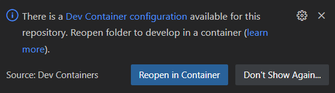

# Chardev Demo and Adapter Setup
This demo consists of two FIFOs which are connected to the SIL Kit via ``sil-kit-adapter-generic-linux-io`` as a SIL Kit participant. These character devices are attached to the SIL Kit in the form of a DataPublisher/DataSubscriber.

In the following diagram you can see the whole setup. It illustrates the data flow going through each component involved.
```
+--[ character devices ]--+
|  ./chardevs/fifo1       |
|  ./chardevs/fifo2       |
+-------------------------+                                    SIL Kit topics:
            |                                                                           +---[ SIL Kit Participant ]---+
             \        +---[ SIL Kit Participant ]---+     |  -- > fromFifo1 > --  | --- |           CANoe             |
              \______ |                             |     |  -- > fromFifo2 > --  |     +-----------------------------+
                      | SilKitAdapterGenericLinuxIO | --- |                       |
                      |                             |     |  -- <  toFifo2  < --  |     +---[ SIL Kit Participant ]---+
                      +-----------------------------+     |                       | --- |        ForwardDevice        |
                                                                                        +-----------------------------+
```

**Note 1:** The character devices used in this demo are FIFOs but the adapter can handle other kinds of character devices as well. For example files like showcased in the Analog-Digital values demo.
**Note 2:** In order to trigger the events happening on the character devices, Linux inotify watchers are instanciated with the ``IN_CLOSE_WRITE`` flag. This means events are only triggered when a file opened for writing is closed again afterwards.

## Create the character devices
In order to get the same setup on your local machine, you can run the following script:
```
source ./chardev/demos/create_chardevs.sh
```

This script will create fifo1 and fifo2 into a main folder ``chardevs``.
> Note that the spawned FIFOs will be automatically deleted when you close the terminal where you sourced the `create_chardevs.sh` script. 

## YAML devices configuration file
### Configure the chardev paths
In order to match the above setup, you need to adapt the chardev ``path`` attributes in the adapter configuration file ``./chardev/demos/DevicesConfig.yaml``. 

# Running the Demo
Now is a good point to start the ``sil-kit-registry`` and the ``sil-kit-adapter-generic-linux-io``. In separate terminals:
```
/path/to/SilKit-x.y.z-$platform/SilKit/bin/sil-kit-registry --listen-uri 'silkit://0.0.0.0:8501'
    
./bin/sil-kit-adapter-generic-linux-io --log Debug --adapter-configuration ./chardev/demos/DevicesConfig.yaml
```

You should see the following output:
```
[date time] [SilKitAdapterGenericLinuxIO] [info] Creating participant 'SilKitAdapterGenericLinuxIO' at 'silkit://localhost:8501', SIL Kit version: <version>
[date time] [SilKitAdapterGenericLinuxIO] [info] Connected to registry at 'tcp://127.0.0.1:8501' via 'tcp://127.0.0.1:34612' (local:///tmp/SilKitRegic044495579071f55.silkit, silkit://localhost:8501)
[date time] [SilKitAdapterGenericLinuxIO] [info] Creating participant SilKitAdapterGenericLinuxIO with registry silkit://localhost:8501
...
[date time] [SilKitAdapterGenericLinuxIO] [debug] Serializing and publishing initial values
[date time] [SilKitAdapterGenericLinuxIO] [debug] Serializing data and publishing on topic: fromFifo1
[date time] [SilKitAdapterGenericLinuxIO] [debug] Serializing data and publishing on topic: fromFifo2
...
Press CTRL + C to stop the process...
```
When the adapter starts it sends the initial values of the handled character devices.

The adapter will then produce output when data are written into the character devices or when the other participants send new values to them.

## Basic Forward Demo
The basic forward demo consists to forward the data from ``fifo1`` to ``fifo2`` using their respective topics ``fromFifo1``, ``toFifo2``.

The data flow is illustrated in the following drawing:
```
                                                         SIL Kit topics:

+--[ fifo1 ]--+      +---[ SIL Kit Participant ]---+      > fromFifo1 >
|             | ---> |                             |       ---------- 
+-------------+      |                             |     /            \     +--[ SIL Kit Participant ]--+
                     | SilKitAdapterGenericLinuxIO | ---                --- |       ForwardDevice       |
+--[ fifo2 ]--+      |                             |     \            /     +---------------------------+
|             | <--- |                             |       ----------
+-------------+      +-----------------------------+       < toFifo2 <
```

You can start the forward device:
```
./bin/sil-kit-demo-glio-chardev-forward-device
```

You should see the following output:
```
[date time] [ChardevForwardDevice] [info] Creating participant 'ChardevForwardDevice' at 'silkit://localhost:8501', SIL Kit version: <version>
[date time] [ChardevForwardDevice] [info] Connected to registry at 'tcp://127.0.0.1:8501' via 'tcp://127.0.0.1:45286' (local:///tmp/SilKitRegic044495579071f55.silkit, silkit://localhost:8501)
Press enter to stop the process...
[date time] [ChardevForwardDevice] [info] Adapter  >> ForwardDevice: message1
[date time] [ChardevForwardDevice] [info] ForwardDevice >> Adapter : message1
```

The GLIO Adapter published the initial data, it means ``message1`` is the initial data from ``fifo1``. Then the forward demo is publishing the value in order to update ``fifo2``.

On the GLIO Adapter window you should see three new lines:
```
[date time] [SilKitAdapterGenericLinuxIO] [debug] New value received on toFifo2
[date time] [SilKitAdapterGenericLinuxIO] [debug] Updating ./chardevs/fifo2
[date time] [SilKitAdapterGenericLinuxIO] [debug] Serializing data and publishing on topic: fromFifo2
```

In your chardevs folder you can see the updated value in ``fifo2``:
```
cat ./chardevs/fifo2
message1
```

Then you can update ``fifo1``:
```
echo "new message" > ./chardevs/fifo1
cat ./chardevs/fifo2
new message
```

The log output should be the same with the new value in ForwardDevice and GLIO Adapter windows.

## Adding CANoe (17 SP3 or newer) as a participant
Before you can connect CANoe to the SIL Kit network you should adapt the ``RegistryUri`` in ``./chardev/demos/SilKitConfig_CANoe.silkit.yaml`` to the IP address of your system where your sil-kit-registry is running.

### CANoe Desktop Edition
Load the ``GLIOControl_chardevs_device.cfg`` from the ``./chardev/demos/CANoe`` directory. After starting the demo, the current file states appears in the *Data Window*. Then you can see the character devices update in this *Data Window*, and you can send data to fifo2 by entering a value in the *DemoPanel* box. Optionally you can also start the test unit execution of included test configuration. While the demo is running these tests should be successful. They set *"send_receive_test"* to fifo2, then send this new value and receive it.

### CANoe4SW Server Edition (Windows)
You can also run the same test set with ``CANoe4SW SE`` by executing the following powershell script ``./chardev/demos/CANoe4SW_SE/run.ps1``. The test cases are executed automatically and you should see a short test report in powershell after execution.

### CANoe4SW Server Edition (Linux)
You can also run the same test set with ``CANoe4SW SE (Linux)``. At first you have to execute the powershell script ``./chardev/demos/CANoe4SW_SE/createEnvForLinux.ps1`` on your windows system by using tools of ``CANoe4SW SE (Windows)`` to prepare your test environment for Linux. In ``./chardev/demos/CANoe4SW_SE/run.sh`` you should adapt ``canoe4sw_se_install_dir`` to the path of your ``CANoe4SW SE`` installation in your Linux system. Afterwards you can execute ``./chardev/demos/CANoe4SW_SE/run.sh`` in your Linux system. The test cases are executed automatically and you should see a short test report in your terminal after execution.

## Running the demo applications inside a Docker container (Optional)
*Note: This section provides an alternative method for running the demo applications - apart from CANoe Desktop Edition and CANoe4SW Server Edition - inside a Docker container and using the `devcontainers` Visual Studio Code extension. The steps outlined here are optional and not required if you prefer to run the applications directly and manually on your host machine.*

The following tools are needed:
* Visual Studio Code in Windows
* WSL2 with Docker running as a daemon. You will need the *ms-vscode-remote.remote-wsl* Visual Studio Code Extension to connect your Visual Studio Code instance to WSL2.  
    >It is recommended to use a Linux Virtual Machine with Linux kernel version v5.17-rc1 or higher as a remote host to make use of all the Adapter's modes including GPIO (which is not supported by standard WSL or WSL2). You can use the *ms-vscode-remote.remote-ssh* Visual Studio Code extension to connect your Visual Studio Code to a remote Linux host.
* *ms-vscode-remote.remote-containers* Visual Studio Code extension

>In WSL2, it is advisable to use the native filesystem (such as `/home/`) rather than the mounted `/mnt/` filesystem to prevent any performance issues.

### Steps:
Clone the repo and open it with Visual Studio Code. A pop-up will appear and propose to open the project in a container.



Alternatively, you can click on the Dev Containers button at the bottom-left corner of Visual Studio Code, then click on `Reopen in Container`. 

Wait for the Docker image to be built and for the container to start. After that, you can launch the available pre-defined tasks in the Chardev section to acheive the demo setup. 

> The Docker container exposes the TCP/IP port 8501 to the host, which means that adding CANoe as a participant in the following steps shall work out-of-the box if you set SIL Kit's registry-uri to `silkit://localhost:8501`.