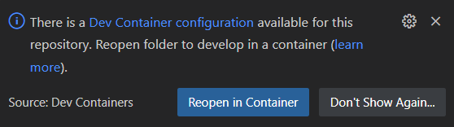

# GPIO Demo and Adapter Setup
This demo consists of two GPIO chips which are connected to the SIL Kit via ``sil-kit-adapter-generic-linux-io`` as a SIL Kit participant. These GPIO chips are attached to the SIL Kit in the form of a DataPublisher/DataSubscriber.

## Simulate GPIO chips
For this demo some GPIO chips have to be simulated. There are multiple ways to do that, the easiest ones are using one the following Linux modules:
- [gpio-mockup](https://docs.kernel.org/admin-guide/gpio/gpio-mockup.html): it needs to be built with the Linux kernel, that is the reason why we don't provide further information for this module.
- [gpio-sim](https://docs.kernel.org/admin-guide/gpio/gpio-sim.html): **requires Linux kernel version v5.17-rc1 or higher**. This is the module used to simulate GPIO chips in this demo. 

To create two GPIO chips like in the following diagram you can run ``sudo ./gpio/demos/create_gpio_sim.sh``. This script sets up the GPIO chips using the gpio-sim module and creates the two instances which appear on the file system as ``/dev/gpiochip0`` and ``/dev/gpiochip1``.

The following diagram illustrates the data flow going through each component involved.

```
+---[ GPIO chip ]---+
|  /dev/gpiochip0   |
|  |-- offset0      |
|  |-- offset1      |
|  |-- offset2      |
|  |-- offset3      |
|  |-- offset4      |                                         SIL Kit topics:
+-------------------+
        |                                           |  -- >        ...         > --  |     +--[ SIL Kit Participant ]--+
         \_____ +---[ SIL Kit Participant ]---+     |  -- > fromGpiochip1Line2 > --  | --- |          CANoe            |
                |                             |     |  -- > fromGpiochip0Line0 > --  |     +---------------------------+
                | SilKitAdapterGenericLinuxIO | --- |                                |  
          _____ |                             |     |  -- <  toGpiochip0Line1  < --  |     +--[ SIL Kit Participant ]--+
         /      +-----------------------------+     |  -- <  toGpiochip1Line1  < --  | --- |       ForwardDevice       |
        |                                           |  -- <        ...         < --  |     +---------------------------+
+---[ GPIO chip ]---+
|  /dev/gpiochip1   |
|  |-- offset0      |
|  |-- offset1      |
|  |-- offset2      |
+-------------------+
```

**Note 1:** In order to avoid running the GLIO adapter as sudo, you should change the owner of the two GPIO chips to you instead of root. This can be done by the following command:
```
sudo chown <new_owner> /dev/gpiochip*
```

**Note 2:** In this demo, the gpiochip0 offset3 and gpiochip1 offset0 are not used.

**Note 3:** In order to clean your system after running the demo, run ``sudo ./gpio/demos/clean_gpio_sim.sh``. This script destroys the simulated chips and cleans the created repositories.

**Note 4:** If needed, you can unload the gpio-sim module with the following command: ``sudo modprobe -r gpio-sim``.

## YAML devices configuration file
### Configure the GPIO chip paths
By default the GPIO chips are located under ``/dev/gpiochipX`` (with X a number). If yours are located somewhere else you should adapt the ``path`` attributes in the adapter configuration file ``./gpio/demos/DevicesConfig.yaml`` in order to match your setup.

# Running the Demo
Now is a good point to start the ``sil-kit-registry`` and the ``sil-kit-adapter-generic-linux-io``. In separate terminals:
```
/path/to/SilKit-x.y.z-$platform/SilKit/bin/sil-kit-registry --listen-uri 'silkit://0.0.0.0:8501'
    
./bin/sil-kit-adapter-generic-linux-io --log Debug --adapter-configuration ./gpio/demos/DevicesConfig.yaml
```

You should see the following output:
```
[date time] [SilKitAdapterGenericLinuxIO] [info] Creating participant 'SilKitAdapterGenericLinuxIO' at 'silkit://localhost:8501', SIL Kit version: 4.0.44
[date time] [SilKitAdapterGenericLinuxIO] [info] Connected to registry at 'tcp://127.0.0.1:8501' via 'tcp://127.0.0.1:57824' (local:///tmp/SilKitRegic044495579071f55.silkit, silkit://localhost:8501)
[date time] [SilKitAdapterGenericLinuxIO] [info] Creating participant SilKitAdapterGenericLinuxIO with registry silkit://localhost:8501
...
[date time] [SilKitAdapterGenericLinuxIO] [debug] Serializing and publishing initial values
[date time] [SilKitAdapterGenericLinuxIO] [debug] Serializing data and publishing on topic: fromGpiochip0Line0
[date time] [SilKitAdapterGenericLinuxIO] [debug] Serializing data and publishing on topic: fromGpiochip0Line1
[date time] [SilKitAdapterGenericLinuxIO] [debug] Serializing data and publishing on topic: fromGpiochip0Line4
[date time] [SilKitAdapterGenericLinuxIO] [debug] Serializing data and publishing on topic: fromGpiochip1Line1
...
Press CTRL + C to stop the process...
```

When the adapter starts it sends the initial values of the handled GPIO chip lines.

The adapter will then produce output when data are written into the GPIO chip lines or when the other participants send new values to them.

## Basic Forward Demo
The basic forward demo consists to forward the value from the ``gpiochip0 line 4`` to the ``gpiochip1 line 2`` using their respective topics ``fromGpiochip0Line4``, ``toGpiochip1Line2``. This means the ``gpiochip0 line 4`` direction is INPUT to be able to read its value, and the ``gpiochip1 line 2`` direction will be reconfigured to OUTPUT to set the new value.

The data flow is illustrated in the following drawing:
```
                                                               SIL Kit topics:

+--[ gpiochip0 ]--+      +---[ SIL Kit Participant ]---+    > fromGpiochip0Line4 >
|     offset4     | ---> |                             |       ---------------- 
+-----------------+      |                             |     /                  \     +--[ SIL Kit Participant ]--+
                         | SilKitAdapterGenericLinuxIO | ---                      --- |       ForwardDevice       |
+--[ gpiochip1 ]--+      |                             |     \                  /     +---------------------------+
|     offset2     | <--- |                             |       ----------------
+-----------------+      +-----------------------------+     < toGpiochip1Line2 <
```

You can start the forward device:
```
./bin/sil-kit-demo-glio-gpio-forward-device
```

You should see the following output:
```
[date time] [GpioForwardDevice] [info] Creating participant 'GpioForwardDevice' at 'silkit://localhost:8501', SIL Kit version: 4.0.44
[date time] [GpioForwardDevice] [info] Connected to registry at 'tcp://127.0.0.1:8501' via 'tcp://127.0.0.1:34144' (local:///tmp/SilKitRegic044495579071f55.silkit, silkit://localhost:8501)
Press enter to stop the process...
[date time] [GpioForwardDevice] [info] Adapter  >> ForwardDevice: INPUT - LOW
[date time] [GpioForwardDevice] [info] ForwardDevice >> Adapter : OUTPUT - LOW
```

The GLIO Adapter published the initial value, it means ``LOW`` is the initial value from the ``gpiochip0 line 4``. Then the forward demo is publishing the value in order to update the ``gpiochip1 line 2``.

On the GLIO Adapter window you should see new lines:
```
[date time] [SilKitAdapterGenericLinuxIO] [debug] New values received on topic: toGpiochip1Line2
[date time] [SilKitAdapterGenericLinuxIO] [debug] Deserializing data from topic: toGpiochip1Line2
[date time] [SilKitAdapterGenericLinuxIO] [debug] Updating gpiochip1 line 2
```

Using the file system, you can see and set the value of your GPIO chip lines. For ``gpiochip1 line 2``:
```
cat /sys/devices/platform/gpio-sim.0/gpiochip1/sim_gpio2/value
0
```

Then you can update the ``gpiochip0 line 4``:
```
echo "pull-up" | sudo tee /sys/devices/platform/gpio-sim.0/gpiochip0/sim_gpio4/pull
cat /sys/devices/platform/gpio-sim.0/gpiochip1/sim_gpio2/value
1
```

The terminal output of the ForwardDevice and the GLIO Adapter will show that new value as well.

## Adding CANoe (17 SP3 or newer) as a participant
Before you can connect CANoe to the SIL Kit network you should adapt the ``RegistryUri`` in ``./gpio/demos/SilKitConfig_CANoe.silkit.yaml`` to the IP address of your system where your sil-kit-registry is running.

### CANoe Desktop Edition
Load the ``GLIOControl_gpio_device.cfg`` from the ``./gpio/demos/CANoe`` directory. After starting the demo, the current file states appears in the *Data Window* and are updated when a value or direction changes. The *DemoPanel* allows you to change the direction and value of the configured lines. Optionally you can also start the test unit execution of included test configuration. While the demo is running these tests should be successful. They set the *gpiochip0 line 1* to *OUTPUT* direction with the corresponding value to *0*, then send this new value and receive it.

### CANoe4SW Server Edition (Windows)
You can also run the same test set with ``CANoe4SW SE`` by executing the following powershell script ``./gpio/demos/CANoe4SW_SE/run.ps1``. The test cases are executed automatically and you should see a short test report in powershell after execution.

### CANoe4SW Server Edition (Linux)
You can also run the same test set with ``CANoe4SW SE (Linux)``. At first you have to execute the powershell script ``./gpio/demos/CANoe4SW_SE/createEnvForLinux.ps1`` on your windows system by using tools of ``CANoe4SW SE (Windows)`` to prepare your test environment for Linux. In ``./gpio/demos/CANoe4SW_SE/run.sh`` you should adapt ``canoe4sw_se_install_dir`` to the path of your ``CANoe4SW SE`` installation in your Linux system. Afterwards you can execute ``./gpio/demos/CANoe4SW_SE/run.sh`` in your Linux system. The test cases are executed automatically and you should see a short test report in your terminal after execution.

## Running the demo application inside a Docker container (Optional)
*Note: This section provides an alternative method for running the demo applications - apart from CANoe Desktop Edition and CANoe4SW Server Edition - inside a Docker container and using the `devcontainers` Visual Studio Code extension. The steps outlined here are optional and not required if you prefer to run the applications directly and manually on your host machine.*

The following tools are needed:
* Visual Studio Code in Windows
* An Ubuntu Virtual Machine with Linux kernel version v5.17-rc1 or higher and Docker running as a daemon (a standard WSL2 is not compatible because it does not support GPIO by default)
    > You can use the *ms-vscode-remote.remote-ssh* Visual Studio Code extension to connect your Visual Studio Code to the Ubuntu Virtual Machine.
* *ms-vscode-remote.remote-containers* Visual Studio Code Extension

### Steps: 
1- Clone the repo on your Virtual Machine (if you have not done that yet).
 
2- On your Ubuntu host, run the `gpio/demos/create_gpio_sim.sh` script as root to instantiate the GPIO chips.
    
    sudo ./gpio/demos/create_gpio_sim.sh 
 
These GPIO chips (`gpiochip0` and `gpiochip1`) will be automatically mounted and accessible on the `/dev` directory of the Docker container. 

3- Open the cloned folder remotely from an instance of Visual Studio Code via SSH (using the *ms-vscode-remote.remote-ssh* Visual Studio Code Extension).

4- A pop-up will appear and propose to open the project in a container.



Alternatively, you can click on the Dev Containers button at the bottom-left corner of  Visual Studio Code, then click on `Reopen in Container`. 

Wait for the Docker image to be built and for the container to start. After that, you can launch the available pre-defined tasks in the GPIO section to acheive the demo setup. 
 
> The Docker container exposes the TCP/IP port 8501 to the host, which means that adding CANoe as a participant in the following steps shall work out-of-the box if you set SIL Kit's registry-uri to `silkit://localhost:8501`.   

**Note:** Be aware that following the previously mentioned steps will build a Docker image and run a Docker container on your system. Make sure you stop the Docker container and clean up any dangling Docker images afterwards.  